# 🌬️ Pearls AQI Predictor (Enhanced Edition)

## 1. Project Overview

The **Pearls AQI Predictor** is an enterprise-grade, **100% serverless end-to-end Machine Learning system** that forecasts air quality index (AQI) and pollutant concentrations. 

The system leverages **2 full years of historical hourly data** to provide both **high-precision 72-hour hourly forecasts** and **7-day trend predictions**, complete with Explainable AI (SHAP), health risk advisories, and an automated serverless MLOps pipeline.

---

## 2. Key Upgrades & Enhanced Scope

### 🌟 1. Deep 2-Year Historical Backfill (~17,500+ Hourly Samples)
* Pull 2 full years of hourly historical meteorological and air quality records using Open-Meteo API.
* Captures all seasonal patterns (winter smog inversions, summer heat, monsoon washouts) and human activity cycles (weekday rush hours vs weekends).

### 🌟 2. Multi-Horizon Forecasting
* **Short-Term (72 Hours / 3 Days)**: High-resolution hourly AQI and PM2.5 forecast for precise daily planning.
* **Medium-Term (7 Days)**: Daily average AQI trajectory and atmospheric trend forecasts.

### 🌟 3. Multi-Pollutant & Dominant Hazard Tracking
* Forecasts individual pollutants: **$\text{PM}_{2.5}$, $\text{PM}_{10}$, $\text{NO}_2$, $\text{O}_3$, $\text{SO}_2$, and $\text{CO}$**.
* Identifies the **Dominant Pollutant** driving the current air quality hazard.

### 🌟 4. Multi-Model Tournament & Leaderboard
* Trains and benchmarks multiple candidate models:
  1. **Persistence / Lag Baseline** (Benchmark)
  2. **Regularized Linear Model** (Ridge Regression)
  3. **Gradient Boosted Decision Trees** (LightGBM / Random Forest)
* Evaluates models using **MAE, RMSE, and $R^2$ Score** with live leaderboard tracking in the dashboard.

### 🌟 5. Explainable AI (SHAP) & Interactive "What-If" Simulator
* Feature importance visualizer using SHAP values (explaining *why* a prediction was made).
* Interactive UI simulator: Adjust wind speed, humidity, or temperature sliders to observe predicted AQI changes in real-time.

### 🌟 6. WHO / EPA Health Risk Advisory Engine
* Translates raw AQI scores into standardized health tiers: *Good, Moderate, Unhealthy for Sensitive Groups, Unhealthy, Very Unhealthy, Hazardous*.
* Delivers tailored, actionable safety precautions (mask advisories, outdoor exercise alerts, ventilation tips).

### 🌟 7. Multi-City Configurable Architecture
* Config-driven setup allowing easy switching between different cities and coordinates.

---

## 3. Technology Stack

* **Language & Core**: Python 3.10+, Pandas, NumPy
* **Machine Learning**: Scikit-learn, LightGBM, SHAP
* **Feature Store & Model Registry**: Hopsworks
* **Orchestration & CI/CD**: GitHub Actions (Hourly automated serverless cron)
* **Data Sources**: Open-Meteo Air Quality & Weather APIs (No API key bottlenecks)
* **Web Dashboard**: Streamlit / Plotly Interactive Charts
* **Knowledge Management**: Obsidian Knowledge Vault (`notes/`)

---

## 4. Pipeline Architecture

```mermaid
graph TD
    subgraph Data Layer
        API1[Open-Meteo Air Quality API]
        API2[Open-Meteo Weather API]
    end

    subgraph Feature Pipeline [GitHub Actions Cron: Hourly]
        A[Data Fetcher] --> B[Feature Engineering & Lag Computation]
        B --> C[(Hopsworks Feature Store)]
    end

    subgraph Training Pipeline [GitHub Actions / On-Demand]
        C --> D[2-Year Historical Time-Series Split]
        D --> E[Model Tournament: Baseline vs Ridge vs LightGBM]
        E --> F[Evaluation: MAE, RMSE, R²]
        F --> G[(Hopsworks Model Registry)]
    end

    subgraph Application Dashboard [Streamlit Community Cloud]
        C --> H[Streamlit UI]
        G --> H
        H --> I[72h Hourly Forecast]
        H --> J[7-Day Trend]
        H --> K[SHAP What-If Simulator]
        H --> L[Health Risk Advisory]
    end

    API1 --> A
    API2 --> A
```

---

## 5. Implementation Milestones

1. **Phase 1: Project Setup & Environment**
   * Dependencies setup (`requirements.txt`), project configuration module (`src/config.py`).
2. **Phase 2: Data Ingestion & 2-Year Historical Backfill**
   * Historical data fetcher, data cleaning, sensor missing-value imputation.
3. **Phase 3: Feature Engineering & Hopsworks Feature Store**
   * Lag features ($AQI_{t-1}, AQI_{t-24}$), rolling averages, cyclical time encodings ($\sin/\cos$).
   * Creation of Hopsworks Feature Groups.
4. **Phase 4: Model Training, Tournament & Model Registry**
   * Chronological time-series split, training Baseline vs Ridge vs LightGBM.
   * Model evaluation (MAE, RMSE, $R^2$) and saving best model to Hopsworks Model Registry.
5. **Phase 5: Automated GitHub Actions CI/CD**
   * Hourly automated feature pipeline runner for serverless data freshness.
6. **Phase 6: Streamlit Dashboard & Explainability**
   * Real-time 72h forecast charts, 7-day outlook, SHAP explainability, What-If simulator, and health advisories.
