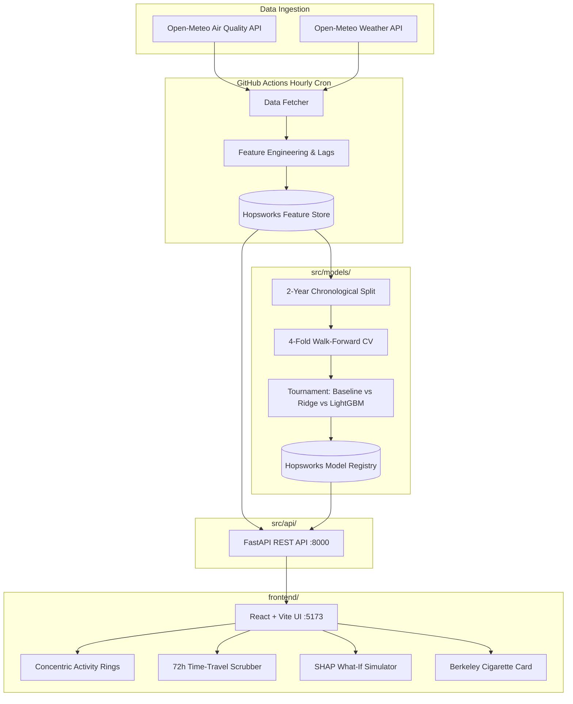

# 🌬️ Pearls AQI Predictor (Multi-City Serverless AI)

An enterprise-grade, **100% serverless Machine Learning system** that forecasts air quality index (AQI) and $\text{PM}_{2.5}$ concentrations for **Karachi, Lahore, and Islamabad**.

Powered by **2 years of historical hourly data**, **4-Fold Walk-Forward Cross-Validation**, **Explainable AI (SHAP)**, **FastAPI REST backend**, and a **Pixel-Perfect Nordic Slate React Frontend** with automated **GitHub Actions** hourly pipeline execution.

---

## 🌟 Key Features

* 🏙️ **Multi-City Support**: High-precision forecasts for **Karachi** (coastal), **Lahore** (inland plains), and **Islamabad** (sub-Himalayan foothills).
* ⭕ **Concentric Activity Rings (Hero Gauge)**: High-resolution SVG rings for $\text{PM}_{2.5}$, $\text{PM}_{10}$, and $\text{NO}_2$ with glowing status badges.
* ⏱️ **Interactive Time-Travel Scrubber**: Smooth 72-hour timeline scrubber that morphs all cards, rings, and health metrics in real time.
* 🚬 **Berkeley Earth Cigarette Metric**: Converts abstract PM2.5 concentrations into cigarette equivalents with burning ember animation.
* 🏃 **2x2 Health Action Grid**: Dynamic advice for Outdoor Cardio, Home Ventilation, Asthmatic Alert, and Mask Requirements.
* 🎛️ **Interactive SHAP "What-If" Simulator**: Live weather sliders (wind speed, humidity, temperature) showing real-time predicted AQI changes.
* 🏆 **Machine Learning Tournament**: Benchmarked **Persistence Baseline vs Ridge Regression vs LightGBM** evaluated via MAE, RMSE, and $R^2$.
* 🔄 **4-Fold Time-Series Cross-Validation**: Rigorous walk-forward temporal cross-validation across all 4 seasons with zero shuffle leakage.
* ⏱️ **Serverless Automation**: Hourly cron pipeline via GitHub Actions costing **$0.00 / month**.
* 📓 **Obsidian Knowledge Vault**: 10+ interconnected conceptual notes written in plain, human-friendly English located in `notes/`.

---

## 🏗️ Architecture



---

## 🚀 Quick Start (Running Locally)

### 1. Start the FastAPI Backend (Terminal 1)
```powershell
python -m uvicorn src.api.app:app --host 127.0.0.1 --port 8000 --reload
```
*API docs available at: `http://127.0.0.1:8000/docs`*

### 2. Start the React Frontend (Terminal 2)
```powershell
cd frontend
npm run dev
```
*The Nordic Slate dashboard will open at: `http://localhost:5173`*

---

## 📂 Repository Structure

```
Pearls-AQI-Predictor/
├── .github/workflows/
│   └── feature_pipeline.yml         # Hourly automated GitHub Actions serverless cron
├── frontend/                        # ⚛️ React + Vite Nordic Slate UI
│   ├── src/
│   │   ├── components/
│   │   │   ├── ConcentricRings.jsx  # ⭕ SVG Concentric Activity Rings
│   │   │   ├── CigaretteCard.jsx    # 🚬 Berkeley Earth Cigarette metric & ember
│   │   │   ├── LifestyleGrid.jsx    # 🏃 2x2 Action Tiles (Cardio, Windows, etc.)
│   │   │   ├── TimeTravelScrubber.jsx # ⏱️ 72h Timeline Scrubber bar
│   │   │   ├── PollutantBars.jsx    # 📊 WHO safety guideline progress bars
│   │   │   ├── ForecastChart.jsx    # 📈 72h Spline Area Forecast Curve
│   │   │   ├── WhatIfSimulator.jsx  # 🎛️ Interactive SHAP What-If Sliders
│   │   │   └── LeaderboardTab.jsx   # 🏆 4-Fold CV Tournament Leaderboard
│   │   ├── App.jsx                  # Main dashboard coordinator
│   │   └── index.css                # Nordic Slate design tokens & animations
├── notes/                           # 📓 Obsidian Knowledge Vault (Open as Vault in Obsidian)
│   ├── 00-Index.md                  # Master interactive knowledge map
│   ├── 01-architecture/             # Serverless stack, Feature store, FastAPI bridge
│   ├── 02-data-pipeline/            # Data ingestion, Lags/Rolling, Hopsworks
│   ├── 03-machine-learning/         # Tournament, Chronological splits, 4-Fold CV, SHAP
│   └── 04-deployment/               # Nordic Slate UI, GitHub Actions
├── src/
│   ├── api/
│   │   └── app.py                   # ⚡ FastAPI REST API Microservice
│   ├── features/
│   │   ├── data_fetcher.py          # Open-Meteo multi-city data ingestion
│   │   ├── feature_engineering.py   # Lags, rolling averages, cyclical sin/cos encodings
│   │   └── hopsworks_pipeline.py    # Cloud feature group & model registry sync
│   ├── models/
│   │   ├── train.py                 # 4-Fold CV, ML Tournament, & model serialization
│   │   └── explainability.py        # SHAP TreeExplainer & What-If scenario engine
│   └── config.py                    # Centralized coordinates, pollutants, & EPA categories
├── AGENTS.md                        # AI agent governance & mentorship rules
├── Project.md                       # Complete project specification & scope
├── requirements.txt                 # Pinned dependencies
└── README.md
```
