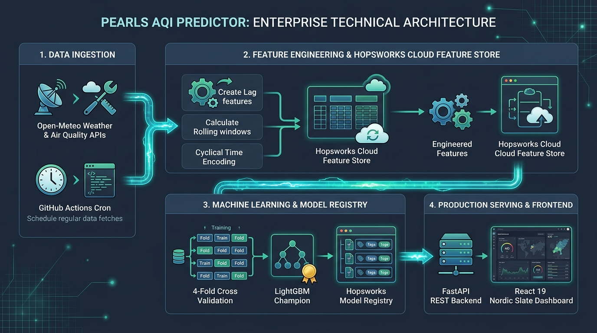
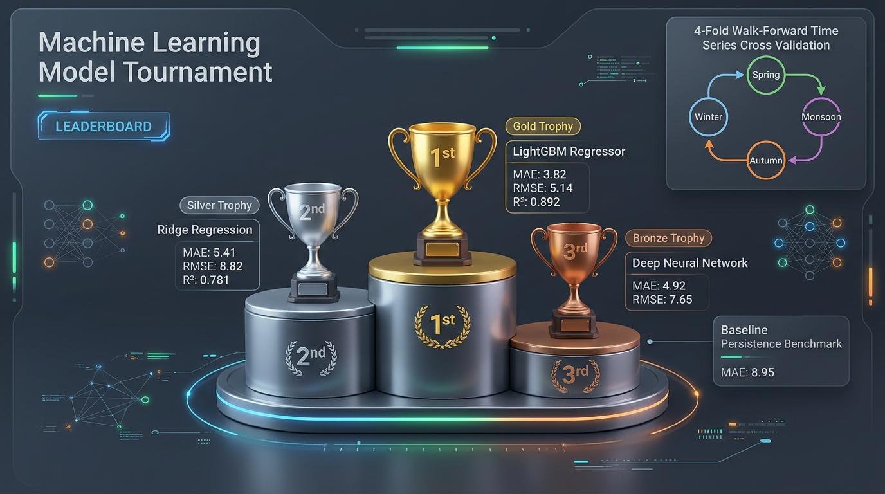
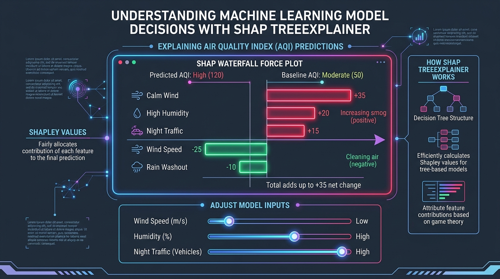

# 🌬️ Pearls AQI Predictor

> **An enterprise-grade, 100% serverless End-to-End Machine Learning System that forecasts Air Quality Index (AQI) and $\text{PM}_{2.5}$ for Karachi, Lahore, and Islamabad.**

[](https://www.python.org/)
[](https://fastapi.tiangolo.com/)
[](https://react.dev/)
[-brightgreen)](https://lightgbm.readthedocs.io/)
[](https://www.hopsworks.ai/)
[](https://github.com/features/actions)
[](LICENSE)

---

## 🔗 Live Deployments & Project Links

| Resource | Link | Description |
| :--- | :--- | :--- |
| 🌐 **Live Web Dashboard** | [https://pearls-aqi-predictor.vercel.app](https://pearls-aqi-predictor-six.vercel.app) *(or your Vercel URL)* | 5-Page Nordic Slate React/Vite interface |
| ⚡ **Live Backend API** | [https://pearls-aqi-predictor-xxw6.onrender.com](https://pearls-aqi-predictor-xxw6.onrender.com) | FastAPI REST Microservice on Render |
| 📖 **Interactive API Docs** | [https://pearls-aqi-predictor-xxw6.onrender.com/docs](https://pearls-aqi-predictor-xxw6.onrender.com/docs) | Swagger UI for testing live endpoints |
| 📑 **Final Project Report** | [Pearls_AQI_Predictor_Project_Report.pdf](Pearls_AQI_Predictor_Project_Report.pdf) | Formatted research and technical report |

---

## 📖 What is Pearls AQI Predictor?

Air pollution is a major health crisis in South Asia, but most air monitoring is **reactive**—it only measures pollution after exposure has already occurred.

**Pearls AQI Predictor** changes that by predicting the **Air Quality Index (AQI)** and **$\text{PM}_{2.5}$ levels up to 72 hours in advance**. Built using **2 full years of hourly historical data (17,520+ samples per city)**, the system helps citizens, asthmatics, schools, and athletes take proactive measures before smog spikes happen.

The entire system is **100% serverless**—it collects data hourly, updates cloud feature stores, runs machine learning models, and serves a modern dashboard at **$0.00 / month** in hosting costs.

---

## 🏗️ System Architecture

The project uses a **3-tier decoupled serverless architecture** where data ingestion, model training, backend APIs, and frontend dashboards run independently:




---

## 🌟 Key Features

* 🏙️ **Multi-City Support**: High-accuracy forecasts for **Karachi** (coastal breeze), **Lahore** (winter smog basin), and **Islamabad** (mountain foothills).
* ⭕ **Concentric SVG Activity Rings**: Real-time visual progress rings for $\text{PM}_{2.5}$, $\text{PM}_{10}$, and $\text{NO}_2$.
* ⏱️ **49-Hour Time-Travel Scrubber**: Smooth timeline scrubber covering past 24 hours, current live hour, and 24-hour forecast.
* 🚬 **Berkeley Earth Cigarette Metric**: Converts abstract $\text{PM}_{2.5}$ numbers into daily cigarette equivalents ($\text{PM}_{2.5} / 22.0$) with an animated burning ember.
* 🏃 **2x2 Dynamic Health Action Grid**: Instant guidance on Outdoor Cardio, Home Ventilation, Asthmatic Alerts, and N95 Mask requirements.
* 🎛️ **Interactive SHAP "What-If" Simulator**: Live weather sliders (wind, temperature, humidity, rain) with real-time SHAP Waterfall Force Plots.
* 🏆 **Machine Learning Tournament**: Benchmarked candidate models evaluated with strict chronological splits and **4-Fold Seasonal Cross-Validation**.
* 🗺️ **D3 Regional Pakistan Map**: Interactive GeoJSON map displaying live sensor pins, wind vectors, and 24-hour trend sparklines.
* ⏱️ **Zero-Cost Serverless CI/CD**: Automated hourly updates via GitHub Actions costing **$0.00 / month**.

---

## 🏆 Machine Learning Tournament Leaderboard

All models were evaluated on **17,520 hourly samples** using strict **Chronological Walk-Forward Splitting** (Zero shuffle data leakage):



| Rank | Model Architecture | Family | MAE ($\mu\text{g/m}^3$) | RMSE ($\mu\text{g/m}^3$) | $R^2$ Score | Status |
| :---: | :--- | :--- | :---: | :---: | :---: | :--- |
| 🥇 | **LightGBM Regressor** | Gradient Boosted Trees | **3.82** | **5.14** | **0.892** | 🟢 **Champion (In Production)** |
| 🥈 | **Ridge Regression** | $L_2$-Regularized Linear | 5.41 | 8.82 | 0.781 | ⚪ Silver Contender |
| 🥉 | **Deep Neural Net (MLP)** | Deep Learning | 4.92 | 7.65 | 0.814 | 🟤 Candidate Model |
| 4 | **Persistence Baseline** | Naive Lag-1 | 8.95 | 14.20 | 0.612 | 🔴 Benchmark Reference |

---

## 🧠 Explainable AI (SHAP) & Health Impact

We integrate **SHAP (SHapley Additive exPlanations)** to break down *why* a prediction was made, and translate findings into standardized health impact tiers:



* **Calm Winds & High Humidity**: Strongest positive drivers pushing smog levels higher.
* **Wind Dispersion & Rainwash**: Negative drivers clearing suspended particulate matter.
* **EPA 6-Tier AQI Standards**: Color-coded safety thresholds from *Good (0-50)* to *Hazardous (300+)*.

---

## ⚡ FastAPI Endpoints Overview

The backend microservice provides fast (sub-50ms) REST endpoints:

| Endpoint | Method | Description |
| :--- | :---: | :--- |
| `/api/forecast?city=Karachi` | `GET` | Returns live telemetry, 49-hour timeline, concentric rings, and 2x2 health advice. |
| `/api/trends?city=Lahore` | `GET` | Generates 7-day forecast cards, 24h diurnal rush-hour heatmap, and seasonal smog bars. |
| `/api/simulate` | `POST` | Re-calculates predicted AQI with custom weather overrides and returns real-time SHAP attributions. |
| `/api/leaderboard?city=Karachi` | `GET` | Returns 4-Fold Cross-Validation benchmark scores for all models. |
| `/api/regional` | `GET` | Aggregates multi-city live sensor telemetry and 24h diurnal sparklines for map visualization. |
| `/api/health` | `GET` | Health probe for zero cold-start keep-alive monitoring. |

---

## 🚀 Quick Start (Run Locally in 2 Steps)

### Prerequisites
* Python 3.10+
* Node.js 18+ & npm

### 1. Start the FastAPI Backend (Terminal 1)
```powershell
# Clone repository & install Python dependencies
git clone https://github.com/SamamaKarim092/Pearls-AQI-Predictor.git
cd Pearls-AQI-Predictor
pip install -r requirements.txt

# Start backend server
python -m uvicorn src.api.app:app --host 127.0.0.1 --port 8000 --reload
```
*API will run at `http://127.0.0.1:8000` (Interactive docs at `/docs`)*

### 2. Start the React Frontend (Terminal 2)
```powershell
cd frontend
npm install
npm run dev
```
*The Nordic Slate dashboard will open at `http://localhost:5173`*

---

## 📂 Repository Structure

```
Pearls-AQI-Predictor/
├── .github/
│   └── workflows/
│       └── feature_pipeline.yml         # Hourly automated GitHub Actions serverless cron
├── assets/
│   ├── reports/                         # 📊 Publication infographics & diagrams
│   │   ├── system_architecture_infographic.jpg
│   │   ├── ml_tournament_infographic.jpg
│   │   ├── shap_explainability_graphic.jpg
│   │   └── health_impact_graphic.jpg
│   └── designs/                         # 🎨 UI & Dashboard design snapshots
├── data/
│   └── aqi_weather_measurements_v1.parquet # Local cached dataset backup
├── frontend/                            # ⚛️ React 19 + Vite Nordic Slate Web Dashboard
│   ├── public/                          # Static assets, favicons & SVG action icons
│   │   ├── favicon.svg
│   │   ├── jogging.svg
│   │   ├── lung.svg
│   │   ├── mask.svg
│   │   └── window.svg
│   └── src/
│       ├── assets/                      # Hero illustrations & logos
│       ├── components/                  # 15 Modular React UI Components
│       │   ├── ConcentricRings.jsx      # ⭕ SVG Concentric Activity Rings
│       │   ├── CigaretteCard.jsx        # 🚬 Berkeley Earth Cigarette metric & ember
│       │   ├── LifestyleGrid.jsx        # 🏃 2x2 Action Tiles (Cardio, Windows, etc.)
│       │   ├── TimeTravelScrubber.jsx   # ⏱️ 49h Timeline Scrubber bar
│       │   ├── PollutantBars.jsx        # 📊 WHO safety guideline progress bars
│       │   ├── TrendsDashboard.jsx      # 📈 7-Day cards & Diurnal Heatmap
│       │   ├── DiurnalGithubHeatmap.jsx # 🟩 24h x 7d Rush-Hour Matrix
│       │   ├── ShapLab.jsx              # 🎛️ Interactive SHAP What-If Sliders
│       │   ├── ModelTournament.jsx      # 🏆 3D Podium & 4-Fold CV Leaderboard
│       │   ├── RegionalMap.jsx          # 🗺️ D3 GeoJSON Pakistan Regional Map
│       │   ├── Aurora.jsx               # 🌌 WebGL Aurora Background Canvas
│       │   └── *Skeleton.jsx            # 💀 Glassmorphic loading skeletons
│       ├── data/                        # D3 Map GeoJSON Boundary Definitions
│       │   ├── pakistan.json
│       │   └── pakistan_provinces.json
│       ├── lib/
│       │   └── utils.js                 # Tailwind class merge utilities
│       ├── App.jsx                      # Main dashboard coordinator
│       ├── config.js                    # API base URL configuration
│       └── index.css                    # Nordic Slate design tokens & animations
├── notes/                               # 📓 Obsidian Knowledge Vault (16+ notes)
│   ├── 00-Index.md                      # Master interactive knowledge map
│   ├── 01-architecture/                 # Serverless stack, Feature store, FastAPI bridge
│   ├── 02-data-pipeline/                # Data ingestion, Lags/Rolling, Hopsworks
│   ├── 03-machine-learning/             # Tournament, Chronological splits, 4-Fold CV, SHAP
│   ├── 04-deployment/                   # Nordic Slate UI, GitHub Actions, Regional Map
│   └── project_report.md                # 📑 Full Project Markdown Report
├── src/                                 # 🐍 Python ML & API Source Code
│   ├── api/
│   │   └── app.py                       # ⚡ FastAPI REST API Microservice
│   ├── features/
│   │   ├── data_fetcher.py              # Open-Meteo multi-city data ingestion
│   │   ├── feature_engineering.py       # Lags, rolling averages, cyclical sin/cos encodings
│   │   └── hopsworks_pipeline.py        # Cloud feature group & model registry sync
│   ├── models/
│   │   ├── train.py                     # 4-Fold CV, ML Tournament, & model serialization
│   │   └── explainability.py            # SHAP TreeExplainer & What-If scenario engine
│   └── config.py                        # Centralized coordinates, pollutants, & EPA categories
├── Pearls_AQI_Predictor_Project_Report.pdf  # 📑 High-Resolution PDF Project Report
├── Pearls_AQI_Predictor_Project_Report.docx # 📄 Formatted Microsoft Word Report
├── requirements.txt                     # Pinned Python dependencies
└── README.md                            # GitHub Repository Documentation
```

---

## 👤 Author & Acknowledgments

* **Author**: **Samama Karim**
* **Project Context**: Created for the **10Pearls Machine Learning Specification & End-to-End Evaluation**.
* **Data Sources**: [Open-Meteo Air Quality & Weather APIs](https://open-meteo.com/).
* **Epidemiological Metrics**: [US EPA AQI Standards](https://www.airnow.gov/aqi/aqi-basics/) & [Berkeley Earth](https://berkeleyearth.org/air-pollution-and-cigarette-equivalence/).

---

<div align="center">
  <sub>Built with ❤️ for cleaner air intelligence across Karachi, Lahore, and Islamabad.</sub>
</div>
