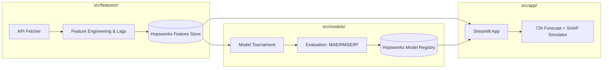

# 🌟 01. Project Overview and the Serverless ML Stack

Parent: [[00-Index]] | Topic: Architecture & Foundations

---

### 1. What is this in Simple English? (The Everyday Analogy)

Imagine you run an outdoor cafe or want to plan your weekly running schedule. You want to know: **"Will the air outside be clean or smoggy over the next 3 to 7 days?"**

To answer this, our system acts like a team of automated meteorology assistants:
1. **The Historian & Collector**: Backfills **2 full years of past weather & air pollution history** (~17,500 hourly records) and checks sensors every hour.
2. **The Pantry (Hopsworks Feature Store)**: Cleans measurements, calculates trends (e.g., "is pollution rising?", 24h rolling averages), and keeps them neatly organized.
3. **The Predictor (Machine Learning Tournament)**: Evaluates multiple AI models (Baseline vs Ridge Regression vs LightGBM) to forecast high-precision 72-hour hourly forecasts and 7-day trends.
4. **The Explainer (SHAP & What-If Simulator)**: Shows *why* air is polluted and lets users test what happens if wind speeds pick up.
5. **The Health Advisor**: Categorizes air quality into EPA tiers (Good to Hazardous) and provides tailored health advice (e.g., masks, ventilation).
6. **The Dashboard (Streamlit Web App)**: Displays interactive charts to anyone visiting the site.

---

### 2. What Does "100% Serverless" Mean?

In traditional software, you rent an expensive 24/7 cloud server (like AWS EC2).
In our **Serverless Stack**, we pay **$0** and manage zero servers:
* Automated cloud workers wake up on schedule (GitHub Actions), run for 15 seconds, save fresh data to Hopsworks, and shut down.
* The web app (Streamlit) sleeps until a user opens the page, instantly loading features and models on demand.

| Component | Traditional Approach | Our Serverless Approach |
| :--- | :--- | :--- |
| **Data Storage** | Self-hosted Database ($$$) | **Hopsworks Feature Store** (Free Tier) |
| **Automation** | Always-on Server ($$$) | **GitHub Actions** (Free Cron Scheduler) |
| **Model Hosting** | Custom Cloud Endpoint | **Hopsworks Model Registry** |
| **User Interface** | Dedicated Web Server | **Streamlit Community Cloud** (Free) |

---

### 3. Related Project Files & Blueprint

* **`Project.md`**: Master roadmap defining project deliverables, 2-year backfill scope, multi-horizon forecasting, and evaluation standards.
* **`AGENTS.md`**: AI mentorship rules, time-series ML guardrails, and coding conventions.
* **`requirements.txt`**: Pinned Python dependencies (`pandas`, `scikit-learn`, `lightgbm`, `shap`, `hopsworks`, `streamlit`).
* **`.gitignore`**: Protects secret keys (`.env`) and cache files from leaking into Git.

---

### 4. Decoupled Pipeline Architecture

---

### Next Up
* [[02-Why-Feature-Store-and-Hopsworks]]
